# VASP Language Server

<div align="center">


[](package.json)
[](LICENSE)
[](https://www.vasp.at/wiki)

**Intelligent editing experience for Vienna Ab initio Simulation Package (VASP) input files.**

[Features](#features) • [Installation](#installation) • [Usage](#usage) • [Configuration](#configuration) • [Architecture](#architecture) • [Contributing](#contributing)

</div>

---

## 📖 Overview

The **VASP Language Server** brings modern IDE features to the world of computational materials science. Built on the **Language Server Protocol (LSP)**, it provides instant feedback, validation, and documentation for VASP input files (`INCAR`, `POSCAR`), helping researchers avoid costly simulation errors before they happen.

Stop checking `OUTCAR` for syntax errors. Catch them as you type.

### Why use this?

* **Prevent Crashes**: Validates `POSCAR` geometry and `INCAR` types strictness.
* **Learn VASP**: Hover over tags in `INCAR` to see documentation from the VASP Wiki.
* **Save Time**: Autocomplete tags and values instead of checking the manual.

---

## ✨ Features

### Feature Matrix

| Feature | INCAR | POSCAR | POTCAR | KPOINTS |
| :--- | :---: | :---: | :---: | :---: |
| **Syntax Validation** | ✅ | ✅ | 🔜 | 🔜 |
| **Type Checking** | ✅ | ✅ | - | - |
| **Documentation (Hover)** | ✅ | ❌ | - | - |
| **Autocomplete** | ✅ | ❌ | - | - |
| **Formatting** | 🔜 | 🔜 | - | - |
| **Cross-File Checks** | ❌ | ✅ | 🔜 | - |

### 🚀 INCAR (VASP 6.5.x)

- **Robust Parsing**: Handles multi-line statements (`\`), inline comments (`#`, `!`), and semicolons (`;`).
* **Strict Linting**: Validates over **50+ tags** against their expected types:
  * `ISMEAR` must be an `Integer`.
  * `ENCUT` must be a `Float`.
  * `LREAL` must be a `Boolean` (`.TRUE.`, `T`, `False`).
  * Warns on **unknown tags** to catch typos (`ISMEAR` vs `ISMear`).
* **Smart Hover**: Hover over any known tag to view its description, default value, and data type.
* **Autocomplete**: Type `=` to see a list of valid tags and descriptions.

### 📐 POSCAR

- **Structural Integrity**: Validates the 3x3 lattice matrix.
* **Consistency Check**: Ensures the number of atom coordinates matches the species counts provided in the header.
* **Format Support**: Handles VASP 5.x (explicit species) and VASP 4.x (implicit) formats.
* **Selective Dynamics**: Validates `T`/`F` flags when selective dynamics is enabled.

---

## 🏗 Architecture

The server communicates with your editor via standard input/output (stdio) using JSON-RPC.

```mermaid
sequenceDiagram
    participant Editor as 💻 Editor (Client)
    participant Server as ⚙️ VASP LSP (Server)
    participant Parser as 📝 Parser
    participant Linter as 🔍 Linter
    participant DB as 📚 Tag Database

    Editor->>Server: textDocument/didChange (INCAR)
    Server->>Parser: Parse Content
    Parser-->>Server: AST (Tags, Values, Ranges)
    
    Server->>Linter: Validate AST
    Linter->>DB: Lookup Tag Definitions (VASP 6.5)
    DB-->>Linter: Types & Constraints
    Linter-->>Server: Diagnostics (Errors/Warnings)
    
    Server->>Editor: textDocument/publishDiagnostics
    Note over Editor: Renders red squiggles 〰️
```



For a deep dive into the internal design, see [docs/ARCHITECTURE.md](docs/ARCHITECTURE.md).

---

## 📦 Installation

### Prerequisites

- **Node.js** (v14 or higher)
* **npm**

### Quick Start (Source)

1. Clone the repository:

    ```bash
    git clone https://github.com/TheFermiSea/vasp-language-server.git
    cd vasp-language-server
    ```

2. Install dependencies and build:

    ```bash
    npm install
    npm run build
    ```

3. (Optional) Create a global binary symlink:

    ```bash
    npm link
    ```

---

## 🔌 Usage

### Neovim (using `nvim-lspconfig`)

Add this to your `init.lua`. This configuration assumes you have built the server locally.

```lua
local lspconfig = require('lspconfig')
local configs = require('lspconfig.configs')

-- define custom config if not already present
if not configs.vasp_lsp then
  configs.vasp_lsp = {
    default_config = {
      cmd = { 'node', '/path/to/vasp-language-server/out/server.js', '--stdio' },
      filetypes = { 'vasp', 'poscar', 'incar' },
      root_dir = lspconfig.util.root_pattern('.git', 'INCAR', 'POSCAR'),
      settings = {},
    },
  }
end

lspconfig.vasp_lsp.setup{
    on_attach = function(client, bufnr)
        -- Keybindings for hover, etc.
        local opts = { noremap=true, silent=true, buffer=bufnr }
        vim.keymap.set('n', 'K', vim.lsp.buf.hover, opts)
        vim.keymap.set('n', 'gd', vim.lsp.buf.definition, opts)
    end
}
```

### VS Code

Currently, this requires a generic LSP client extension (like "Run on Save" or "External LSP"):

1. Install an extension that allows running external commands as LSP servers.
2. Point it to: `node /path/to/vasp-language-server/out/server.js --stdio`
3. Map file patterns `INCAR`, `POSCAR` to language ID `vasp`.

**Dedicated VS Code extension coming soon.**

---

## 🤝 Contributing

We welcome contributions! Whether it's adding new tags to the database, improving parser robustness, or adding support for `KPOINTS`.

Please read [docs/CONTRIBUTING.md](docs/CONTRIBUTING.md) for development guidelines.

## 📄 License

MIT © [TheFermiSea](https://github.com/TheFermiSea)
