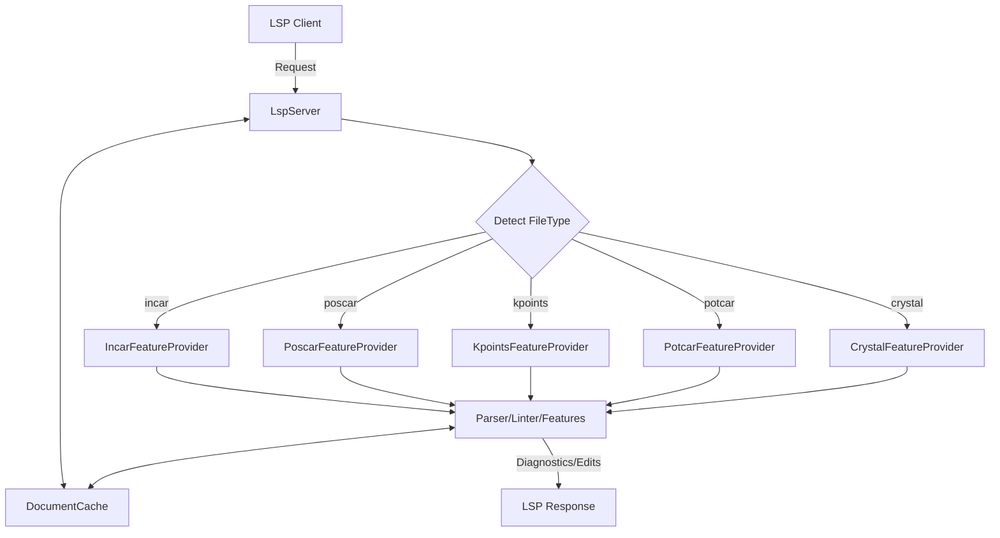

# Architecture Guide

This document explains the internal design of the VASP Language Server.

## High-Level Design

The project follows a standard **Language Server Protocol (LSP)** client-server architecture, optimized for high performance and low memory overhead when handling large scientific datasets (e.g., massive POSCAR files).

- **Client**: The editor (e.g., Neovim, VS Code).
- **Server**: This Node.js process. Parses VASP files and provides intelligent feedback.
- **Transport**: JSON-RPC over `stdio`.

## Directory Structure

We use a feature-based modular structure with a centralized caching layer:

```bash
src/
├── core/
│   ├── lsp-server.ts        # Core LspServer class (Main coordinator)
│   ├── feature-provider.ts  # FeatureProvider registry + base classes
│   ├── parser-utils.ts      # Shared parsing helpers
│   └── document-cache.ts    # AST caching layer (Standardized VaspStructure)
├── features/               # Feature-specific Logic
│   ├── incar/              # INCAR features (Completion, Hover, Folding, etc.)
│   ├── poscar/             # POSCAR features (Folding, Hover, Symbols)
│   ├── kpoints/            # KPOINTS features (Snippets, Hover)
│   ├── potcar/             # POTCAR features (Async Linting)
│   └── crystal/            # CRYSTAL features (Hover, Linting)
├── data/                   # Static data (vasp-tags.ts, crystal-tags.ts)
├── utils/                  # Shared Utilities
├── tools/                  # Standalone Tools (vasp-wiki.ts)
└── server.ts               # Entry point (Thin wrapper)
```

## Core Components

### 1. The LspServer (`src/core/lsp-server.ts`)

The `LspServer` class is the central nervous system. It:

- Manages the `_Connection`.
- Orchestrates `validateTextDocument` across different VASP formats.
- Dispatches requests to feature providers based on detected file type.
- **Strictly Typed**: Uses `vscode-languageserver` interfaces for all handlers.

### 2. FeatureProvider Registry (`src/core/feature-provider.ts`)

Feature providers define the per-file-type handlers (hover, completion, linting, etc.).
The registry maps file types to providers so new formats can be added without updating
switch statements in `LspServer`.

### 3. Document Cache (`src/core/document-cache.ts`)

To prevent redundant parsing across multiple LSP features (e.g., Outline and Folding both needing the same POSCAR AST), we use a `DocumentCache`.

- It stores a `VaspStructure` (a union of `IncarDocument`, `PoscarDocument`, or `KpointsDocument`).
- It is automatically invalidated when file content changes.

### 4. Parser Utilities (`src/core/parser-utils.ts`)

Parsing helpers like whitespace tokenization and range construction are consolidated
in shared utilities to reduce duplication across feature modules.

### 5. High-Performance Parsers

Our parsers are hand-written for speed and memory efficiency:

- **POSCAR**: Uses a specialized state machine to handle files with 100,000+ atoms in <400ms.
- **INCAR**: Converts assignments into a key-value AST with support for comments and types.

### 6. Asynchronous Linting

Features like **POTCAR/POSCAR consistency checks** are implemented asynchronously (`src/features/potcar/linting.ts`) to ensure the main LSP thread never blocks on disk I/O, keeping the editor responsive.

## Architecture Diagram (Request Flow)



## Data Flow

1. **didChange**: Client sends update.
2. **Detect file type**: `LspServer` selects the matching `FeatureProvider`.
3. **Cache update**: Provider parsers build an AST and update `DocumentCache`.
4. **Lint**: Provider linting runs against the cached AST.
5. **Publish**: Diagnostics are pushed to the client.
6. **Feature Requests**: On-demand requests (Hover, Symbols, etc.) read the cached AST and return results.

---

### Last Updated: January 2026
